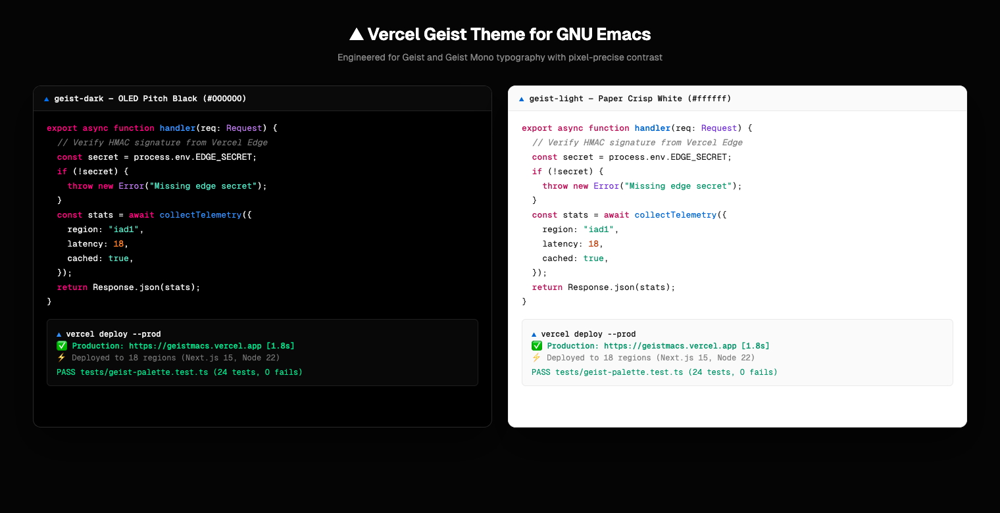
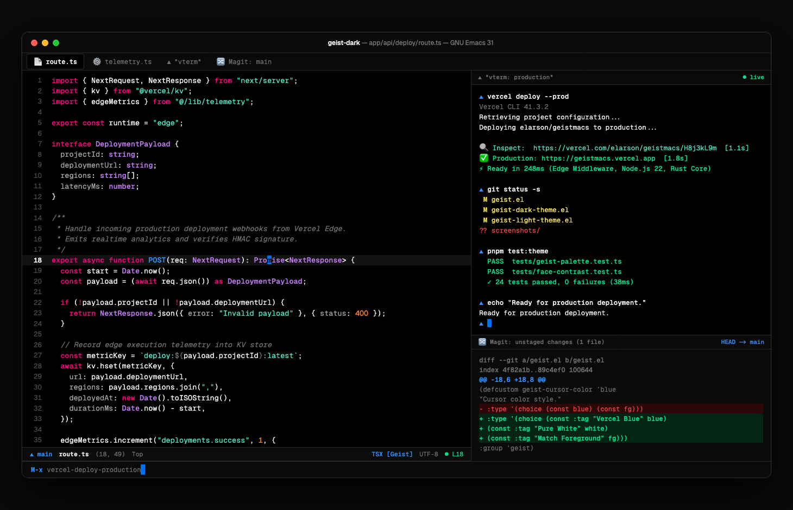
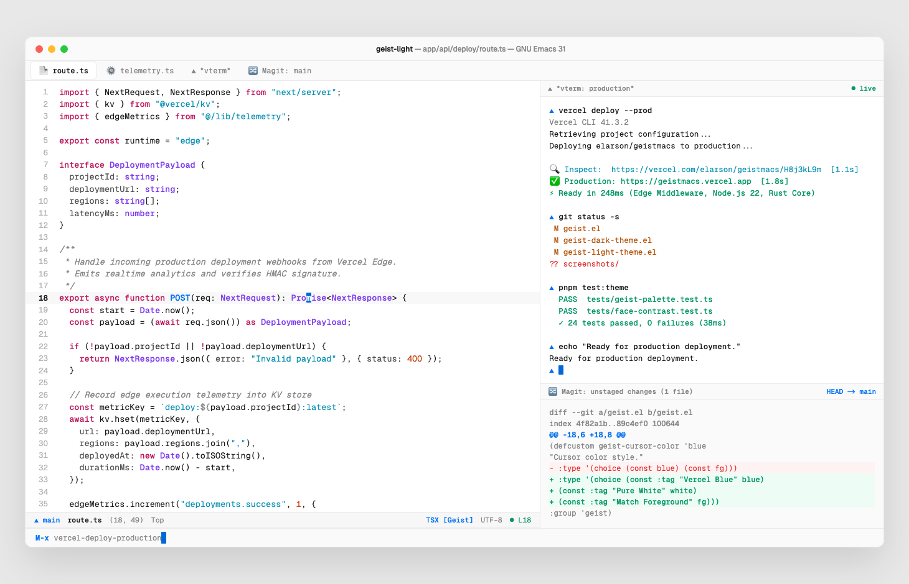
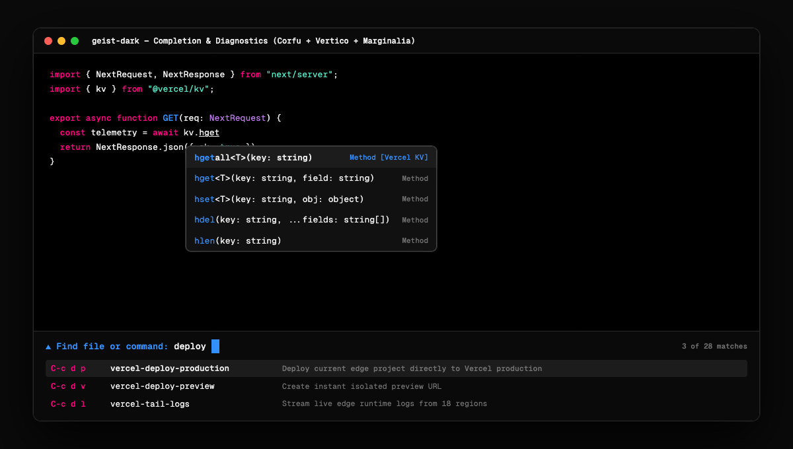

# ▲ Geistmacs — Vercel Geist Theme for GNU Emacs

A minimalist, high-contrast GNU Emacs theme family inspired by Vercel's iconic **Geist design system** and typography. Engineered for **Geist Mono** and **Geist** with pixel-precise contrast, obsidian OLED blacks, paper whites, and signature electric accents.



---

## Previews

### Geist Dark (`geist-dark`)
*True OLED pitch black (`#000000`), razor-thin dividers (`#2a2a2a`), hot-pink keywords, electric blue functions, mint cyan strings, and Vercel CLI terminal integration.*



### Geist Light (`geist-light`)
*Crisp paper white (`#ffffff`), subtle gray elevation surfaces (`#fafafa` / `#f5f5f5`), deep charcoal typography (`#171717`), and balanced contrast.*



### Completion & Diagnostics (Corfu + Vertico + Marginalia)
*Floating autocomplete popups with subtle borders, high-contrast candidate selection, and structured metadata.*



---

## Design Principles

- **True Obsidian Black**: Unlike murky navy or gray themes, `geist-dark` uses pure `#000000` for unmatched contrast and OLED power efficiency.
- **Pure Paper White**: `geist-light` uses `#ffffff` with subtle neutral surfaces (`#fafafa`, `#f5f5f5`) to provide elevation without glare.
- **Hairline Precision**: 1px subtle borders (`#1c1c1c` / `#2a2a2a` in dark, `#eaeaea` in light) separate windows and dialogs cleanly.
- **Vercel Color System**: Accents match official Vercel tokens:
  - **Blue** (`#0070f3` / `#3291ff`): Functions, links, active state indicators.
  - **Pink / Magenta** (`#ff0080` / `#be185d`): Keywords, control flow, tags.
  - **Purple / Violet** (`#8a63d2` / `#6d28d9`): Types, interfaces, primitives.
  - **Cyan / Mint** (`#50e3c2` / `#0891b2`): Strings, regex.
  - **Amber / Orange** (`#ff8024` / `#c2410c`): Numbers, constants.
  - **Emerald Green** (`#00df89` / `#059669`): Success, additions, terminal readiness.
  - **Red** (`#ff4444` / `#dc2626`): Errors, deletions.
  - **Yellow** (`#f5e158` / `#b45309`): Warnings, highlights.

---

## Color Palette

| Token | Dark (`geist-dark`) | Light (`geist-light`) | Primary Usage |
|:---|:---:|:---:|:---|
| `bg-main` | `#000000` | `#ffffff` | Primary editor background |
| `bg-alt` | `#0a0a0a` | `#fafafa` | Subtle elevation, fringes, header |
| `bg-surface` | `#111111` | `#f5f5f5` | Popups, tooltips, dialogs |
| `bg-surface-active` | `#1c1c1c` | `#eaeaea` | Selection, active completion item |
| `bg-highlight` | `#121212` | `#f8f8f8` | Current line (`hl-line`) |
| `bg-region` | `#222222` | `#e5e5e5` | Visual selection / region |
| `fg-main` | `#ededed` | `#171717` | High-contrast text & variables |
| `fg-alt` | `#a1a1a1` | `#525252` | Secondary text, parameters |
| `fg-dim` | `#737373` | `#888888` | Line numbers, comments |
| `fg-muted` | `#4d4d4d` | `#b3b3b3` | Faint text, inactive items |
| `border-main` | `#2a2a2a` | `#eaeaea` | Window dividers, modeline borders |
| `blue-bright` | `#3291ff` | `#0070f3` | Function calls, prompt triangle |
| `pink` | `#ff0080` | `#be185d` | Keywords (`import`, `export`, `return`) |
| `purple` | `#8a63d2` | `#6d28d9` | Types, interfaces |
| `cyan` | `#50e3c2` | `#0891b2` | Strings |
| `orange` | `#ff8024` | `#c2410c` | Numbers, constants |
| `green` | `#00df89` | `#059669` | Success, git additions |
| `red` | `#ff4444` | `#dc2626` | Errors, git deletions |

---

## Installation

### With `straight.el`

```elisp
(straight-use-package
 '(geistmacs :type git :host github :repo "elarson/geistmacs"))

;; Load dark theme by default
(load-theme 'geist-dark t)
```

### With `use-package` (Emacs 29+ with `:vc`)

```elisp
(use-package geist
  :vc (:url "https://github.com/elarson/geistmacs")
  :init
  ;; Optional: configure font setup
  ;; (geist-setup-fonts 14 14)
  :config
  (load-theme 'geist-dark t))
```

### Manual Installation

Clone the repository into your Emacs configuration:

```bash
git clone https://github.com/elarson/geistmacs.git ~/.emacs.d/themes/geistmacs
```

Then add it to your `init.el`:

```elisp
(add-to-list 'custom-theme-load-path "~/.emacs.d/themes/geistmacs")
(add-to-list 'load-path "~/.emacs.d/themes/geistmacs")

(require 'geist)
(load-theme 'geist-dark t)
```

---

## Configuration Options

Customize variables before or after loading the theme:

```elisp
;; Enable or disable bold keywords and function names (default: t)
(setq geist-bold-constructs t)

;; Enable or disable italic comments and docstrings (default: t)
(setq geist-italic-comments t)

;; Enable subtle box outline on the modeline (default: t)
(setq geist-distinct-modeline t)

;; Cursor color style: 'blue (Vercel blue), 'white, or 'fg (default: 'blue)
(setq geist-cursor-color 'blue)

;; Use variable-pitch (Geist) for headings and modeline (default: nil)
(setq geist-use-variable-pitch nil)
```

---

## Interactive Commands

| Command | Description |
|:---|:---|
| `M-x geist-load-dark` | Load `geist-dark` and disable other themes |
| `M-x geist-load-light` | Load `geist-light` and disable other themes |
| `M-x geist-toggle` | Toggle seamlessly between `geist-dark` and `geist-light` |
| `M-x geist-setup-fonts` | Apply `Geist Mono` and `Geist` fonts if installed |

---

## Supported Modes & Packages

- **Core & Syntax**: Built-in `font-lock`, Tree-sitter (`treesit`), line numbers (`display-line-numbers`), `hl-line`, `show-paren`.
- **Completion**: `vertico`, `corfu`, `orderless`, `marginalia`, `consult`, `company`, `ivy`.
- **Terminals & Shells**: `vterm`, `eshell`, `term`, `ansi-color` (supports 16-color ANSI palette).
- **Version Control**: `magit` (full section, hunk, diff, and branch styling), `diff-hl`, `git-gutter`, `smerge`.
- **File Managers**: `dired`, `treemacs`.
- **Diagnostics**: `flymake`, `flycheck`, `eglot`, `lsp-mode`, `lsp-ui`.
- **Notes & Docs**: `org-mode`, `markdown-mode`, `which-key`, `doom-modeline`.

---

## Running the Test Suite & Preview Generator

```bash
# Run unit tests
emacs -Q --batch -L . -L tests -l tests/geist-test.el -f ert-run-tests-batch-and-exit

# Re-generate HTML and PNG previews
emacs -Q --batch -L . -l preview/render-preview.el
firefox --headless --window-size=1460,940 "--screenshot=$(pwd)/screenshots/geist-dark.png" "file://$(pwd)/preview/geist-dark-preview.html"
firefox --headless --window-size=1460,940 "--screenshot=$(pwd)/screenshots/geist-light.png" "file://$(pwd)/preview/geist-light-preview.html"
firefox --headless --window-size=1200,680 "--screenshot=$(pwd)/screenshots/geist-completion-dark.png" "file://$(pwd)/preview/geist-completion-preview.html"
firefox --headless --window-size=1520,780 "--screenshot=$(pwd)/screenshots/geist-comparison.png" "file://$(pwd)/preview/geist-comparison-preview.html"
```

---

## License

MIT License © 2025 Eric Larson
